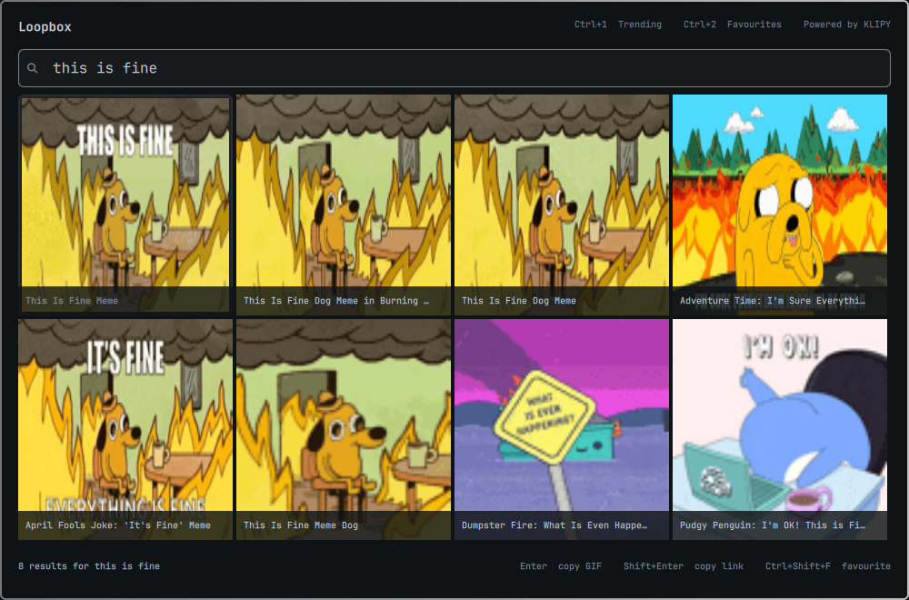

# Loopbox

Loopbox is a fast keyboard-first Omarchy GIF picker and reaction GIF search plugin for Hyprland. It works as a lightweight GIF launcher and Wayland GIF clipboard: search GIFs, browse reactions and trending GIFs, then copy the image or URL without leaving the keyboard.



## What it does

- Searches reaction GIFs through KLIPY with no API key or setup
- Shows trending GIFs as soon as the overlay opens
- Adds a Loopbox image icon to the Omarchy bar
- Adds an optional desktop launcher searchable as `gif` or `Loopbox`
- Loads scrollable results in 24-item pages, capped at 96 per search
- Letterboxes every GIF without stretching or cropping, with its name in a separate caption below
- Opens a large animated preview of the selected GIF with Space
- Copies the original animated GIF as a clipboard file with Enter for Slack and other file-aware apps
- Copies the direct GIF URL with Shift+Enter when an app does not accept image data
- Saves up to 50 favorites and 20 recent selections locally

## Requirements

Loopbox targets current Omarchy 4 releases with the Quickshell-based Omarchy shell. It uses tools included with Omarchy:

- `curl` for GIF search and downloads
- GTK 4 with PyGObject for advertising the GIF as both a clipboard file and `image/gif` data
- `python3`, `jq`, and `hyprctl` for media URL checks, safe local state, and shortcut setup
- Standard `coreutils` and `util-linux` tools for bounded downloads and cache coordination
- `wl-clipboard` through Omarchy's `omarchy-clipboard-paste-file` helper
- Qt image format support for animated GIF previews

Network access is required for search and uncached GIF copies. No API key is required.

## Install

Install and enable Loopbox from its public repository:

```bash
omarchy plugin add https://github.com/ajanraj/omarchy-loopbox.git --enable
```

Omarchy adds the Loopbox image icon to the right side of the bar by default. An interactive install also lets you choose the bar section. Left-click the icon to open Loopbox. If you decline a shortcut, right-click the icon to show setup later.

The first open offers `Super+Ctrl+Shift+L`. Select **Use shortcut** or press Enter to accept it. To choose something else, select **Record shortcut** (or press R), then press the complete combination you want. Super, Ctrl, Alt, and Shift can be used in any combination with standard keys, punctuation, navigation keys, function keys, keypad keys, and common media keys. Loopbox checks the recorded chord against the live Hyprland binding table, including personal shortcuts, and names any conflict. It never unbinds or replaces an existing action.

Omarchy's plugin installer cannot run plugin code or interactive install hooks. Shortcut choice therefore happens inside Loopbox on first launch, after installation. Press Tab to decline a shortcut and keep opening Loopbox from the bar icon. Loopbox remembers that choice; right-click the bar icon if you change your mind.

The same setup panel has an **Add to Omarchy menu** button. Select it once to make Loopbox searchable from `Super+Space` by typing `gif` or `Loopbox`. This remains a clearly labelled, user-initiated action because marketplace plugins do not silently write application launchers.

If the UI action is unavailable, run the same explicit installer directly:

```bash
~/.config/omarchy/plugins/io.github.ajanraj.loopbox/scripts/launcher install
```

Then press `Super+Space`, type `gif` or `Loopbox`, and press Enter.

After confirmation, Loopbox writes its binding to `~/.config/hypr/loopbox.lua`, adds a small managed loader block to `~/.config/hypr/bindings.lua`, reloads Hyprland, and checks for new configuration errors. A failed reload restores both files.

You can also open Loopbox directly:

```bash
omarchy-shell shell toggle io.github.ajanraj.loopbox '{}'
```

If you update an older overlay-only Loopbox checkout, add its new widget to the existing bar layout once:

```bash
omarchy bar put io.github.ajanraj.loopbox --section right
```

## Use

Open Loopbox and start typing or paste into the already-focused search field. Its blinking cursor makes the active filter explicit; an empty query shows trending GIFs.

| Key | Action |
|---|---|
| Arrow keys | Move through the grid |
| Mouse wheel / touchpad | Scroll through results and load the next page near the end |
| Home / End | Select the first / last result |
| Space | Open or close a large preview of the selected GIF |
| Enter | Copy the selected original GIF as a file and `image/gif` data |
| Shift+Enter | Copy the selected GIF URL |
| Ctrl+1 | Show trending GIFs |
| Ctrl+2 | Show favorites |
| Ctrl+Shift+F | Add or remove the selected favorite |
| Ctrl+R | Retry the current search |
| Escape | Clear the query, then close Loopbox |

During shortcut setup, press R or select **Record shortcut**, then hold the modifiers and press the final key. Enter saves an available chord, Tab keeps the active shortcut (or declines the first-time prompt), and Escape cancels recording before closing Loopbox.

The bottom-right shortcut control always shows the active chord. Select it to open setup, safely rebind Loopbox, or add it to the Omarchy menu; if no chord is configured, it reads **Set shortcut**. Right-clicking the bar icon opens the same panel.

GIF cards reserve a caption row below the animation and fit the entire frame inside the image area, so portrait, landscape, and square GIFs remain in proportion and meme text is not cropped. Press Space after selecting a result to fill the Loopbox window with that animation. Arrow keys continue browsing from the preview; Space or Escape returns to the grid.

After Enter succeeds, Loopbox closes and the original `.gif` is ready to paste with `Super+V` or the target application's normal paste shortcut. Loopbox advertises the cached GIF as a file and as `image/gif` bytes, allowing Slack and other apps to choose the representation they support. If an application rejects GIF clipboard files, use Shift+Enter and paste the direct URL instead.

## Provider and privacy

Loopbox uses KLIPY results through Raycast's GIF Search proxy at `gif-search.raycast.com`. This provides install-to-search behavior without asking users for an API key. The proxy is an external, undocumented dependency with no availability guarantee, so provider failures are reported in the overlay and isolated to one adapter for future replacement.

Search queries are sent to Raycast's proxy and KLIPY. Loopbox accepts preview and original images only from KLIPY's HTTPS media host. Uncached GIFs and previews are downloaded directly from publicly routable addresses without following redirects. Loopbox has no analytics and sends no favorites, recents, clipboard contents, or local files.

GIF results and content are provided by [KLIPY](https://klipy.com/). Their terms and the rights attached to individual media still apply.

## Local data

Loopbox stores only:

- Favorites and recents in `$XDG_STATE_HOME/loopbox/state.json` (default: `~/.local/state/loopbox/state.json`)
- Copied original GIF files in `$XDG_CACHE_HOME/loopbox/gifs/` (default: `~/.cache/loopbox/gifs/`)
- Hardened local preview GIFs in `$XDG_CACHE_HOME/loopbox/previews/` (default: `~/.cache/loopbox/previews/`)
- The confirmed shortcut in `~/.config/hypr/loopbox.lua`, loaded by a marked block in `~/.config/hypr/bindings.lua`
- The optional app-menu entry at `$XDG_DATA_HOME/applications/io.github.ajanraj.loopbox.desktop` (default: `~/.local/share/applications/io.github.ajanraj.loopbox.desktop`)
- A shortcut-declined marker at `$XDG_STATE_HOME/loopbox/shortcut-setup-skipped`

The copy cache is bounded to 20 GIFs and 150 MiB. The preview cache is bounded to 48 GIFs and 120 MiB, enough for two 24-result pages without deleting files that visible cards are still decoding. Search responses are limited to 24 results per page and 96 retained results per query; they are not persisted.

## Troubleshooting

**Search does not load:** check network access and retry with Ctrl+R. A rate-limit or provider outage is shown without closing the overlay.

**A GIF will not paste:** confirm GTK 4 and its Python bindings are installed, then retry. Use Shift+Enter to copy the direct URL if the target rejects GIF clipboard files. Loopbox keeps the overlay open when download, validation, or clipboard ownership fails.

**The bar icon is missing:** confirm the plugin is enabled with `omarchy-shell shell listPlugins`, then place its widget with `omarchy bar put io.github.ajanraj.loopbox --section right`.

**The shortcut does nothing:** click the bar icon to open Loopbox, then complete shortcut setup. You can also run the direct toggle command above. Check Hyprland configuration errors with:

```bash
hyprctl reload
hyprctl configerrors
```

## Remove

Remove the managed shortcut first, while the plugin helper is still installed:

```bash
~/.config/omarchy/plugins/io.github.ajanraj.loopbox/scripts/shortcut remove
~/.config/omarchy/plugins/io.github.ajanraj.loopbox/scripts/launcher remove
```

Then remove the plugin checkout and disable it:

```bash
omarchy plugin remove io.github.ajanraj.loopbox
```

The shortcut removal command changes only Loopbox's marked loader block and `loopbox.lua`, then reloads and validates Hyprland. Omarchy intentionally leaves application state and cache alone. Delete these directories yourself if you also want to remove favorites, recents, and cached GIFs:

```bash
gio trash "${XDG_STATE_HOME:-$HOME/.local/state}/loopbox"
gio trash "${XDG_CACHE_HOME:-$HOME/.cache}/loopbox"
```

## Development

Run the focused checks from the repository root:

```bash
node tests/model-test.js
python3 tests/media-url-test.py
bash tests/qml-security-test.sh
bash tests/clipboard-test.sh
bash tests/preview-test.sh
bash tests/state-test.sh
bash tests/shortcut-test.sh
bash tests/launcher-test.sh
omarchy plugin validate .
```

Loopbox runs as unsandboxed QML inside the long-running Omarchy shell. Review plugin source before enabling it, just as you would any other Omarchy plugin.

## License

[MIT](LICENSE)
